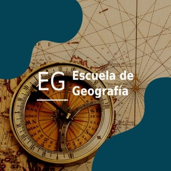

# Carolina Domian

Estudiante de la Escuela de Geografía de la [Universidad de Costa Rica](https://www.geografia.fcs.ucr.ac.cr/index.php/es/).\ 
Carnet C22615\
Cursando el tercer año de carrera\

# Cursos de carrera matriculados I-2024
* Procesamiento de datos geográficos 
* Análisis de datos geográficos I 
* Geografía histórica 
* Geomorfología
